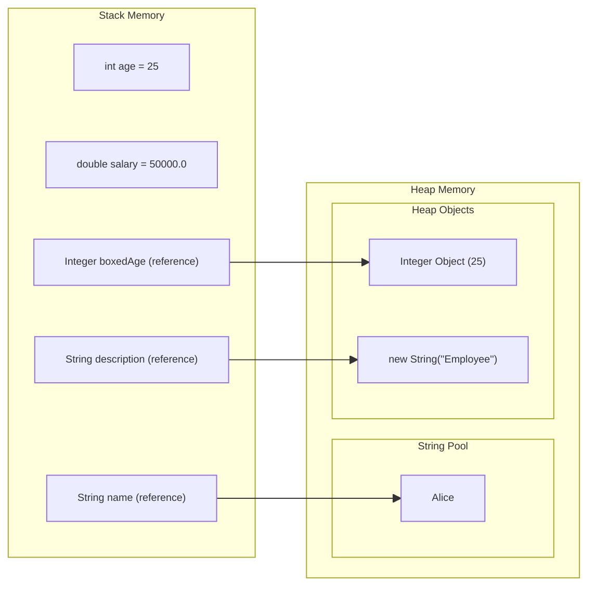
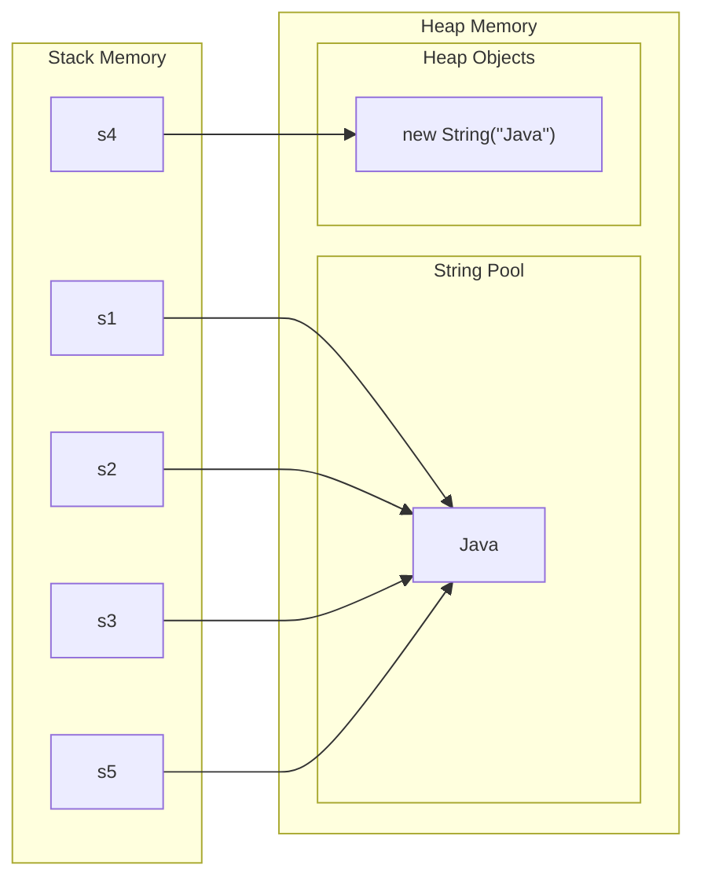

# Introduction to Strings

## What is a String?

A **String** in Java is a sequence of characters used to represent textual data. It is one of the most fundamental and frequently used classes in Java programming.

### Core Characteristics

- **Textual Data Representation**: Strings hold textual information such as names, addresses, messages, file paths, and more
- **Character Sequence**: An ordered collection of characters including letters, digits, symbols, and whitespace
- **Unicode Support**: Java Strings fully support Unicode characters, enabling representation of text in multiple languages and special symbols
- **Reference Type**: String is a class (object type), not a primitive data type
- **Immutable**: Once created, the content of a String object cannot be modified

**Basic Examples**
```java title="Java"
// Simple string literals
String greeting = "Hello, World!";
String name = "John Doe";
String email = "user@example.com";

// Empty string
String empty = "";

// Multi-word strings
String sentence = "This is a complete sentence.";

// Special characters
String symbols = "!@#$%^&*()_+-={}[]|:;<>?,./";

// Unicode and international characters
String unicodeText = "Hello 世界 🌍";
String multilingual = "Bonjour, مرحبا, नमस्ते";
```

### Internal Representation

Understanding how Strings are stored internally helps optimize memory usage:

- **Java 8 and earlier**: Strings are backed by a `char[]` array
- **Java 9+**: Strings use a `byte[]` array with encoding flags for compact storage (Compact Strings feature)
  - Latin-1 encoding for strings containing only ISO-8859-1 characters (1 byte per char)
  - UTF-16 encoding for strings with other characters (2 bytes per char)

```java title="Java"
// Internal structure (conceptual)
public final class String {
    private final byte[] value;  // Java 9+ (was char[] in Java 8)
    private final byte coder;    // Java 9+ (LATIN1 or UTF16)
    private int hash;            // Cached hash code
    
    // ... methods
}
```

### Common Use Cases

Strings are ubiquitous in Java applications:

| Use Case | Example |
|----------|---------|
| User Input/Output | `Scanner.nextLine()`, `System.out.println()` |
| File Operations | File paths, file contents, configuration files |
| Network Communication | URLs, HTTP requests/responses, API data |
| Database Operations | SQL queries, connection strings, result data |
| Data Formats | JSON, XML, CSV parsing and generation |
| Logging | Error messages, debug information, audit trails |
| GUI Applications | Labels, text fields, messages, tooltips |
| Validation | Email validation, password rules, input sanitization |

### String vs Character

It's important to understand the distinction:

```java title="Java"
// String - sequence of characters (can be empty or multi-character)
String text = "Hello";      // Multiple characters
String single = "A";        // Single character (still a String)
String empty = "";          // Empty string (zero characters)

// char - single character primitive type
char letter = 'A';          // Single quotes for char
char digit = '5';
// char invalid = '';       // Error: empty char literal
// char multi = 'AB';       // Error: too many characters
```

---

## String as a Class vs Primitive Types

### Understanding the Difference

Unlike primitive types (`int`, `double`, `boolean`, etc.), String is a **reference type** implemented as a class in the `java.lang` package.

```java title="Java"
// String is a class (reference type)
String text = "Hello";

// These are primitive types
int number = 42;
double price = 99.99;
boolean isActive = true;
char grade = 'A';
```

### Comprehensive Comparison Table

| Aspect | Primitive Types | String (Reference Type) |
|--------|-----------------|-------------------------|
| **Definition** | Built-in data types | Class in java.lang package |
| **Memory Location** | Stack (for local variables) | Reference on stack, object in heap |
| **Memory Size** | Fixed size (int: 4 bytes, double: 8 bytes) | Variable (depends on content) |
| **Default Value** | 0, 0.0, false, '\u0000' | null |
| **Methods** | No methods available | Rich set of methods (100+) |
| **Null Assignment** | Cannot be null | Can be null |
| **Comparison** | Use `==` for value comparison | Use `equals()` for content comparison |
| **Performance** | Faster (direct value access) | Slower (object overhead) |
| **Mutability** | Values can be changed | Immutable (cannot be changed) |
| **Inheritance** | Not objects, no inheritance | Inherits from Object class |
| **Creation** | Direct assignment | Literal or constructor |

### Memory Allocation Details

**Primitive Types**:
```java title="Java"
int age = 25;           // Value 25 stored directly in stack
double salary = 50000.0; // Value stored directly in stack

// Primitive wrapper example
Integer boxedAge = 25;  // Reference in stack, object in heap
```

**String (Reference Type)**:
```java title="Java"
String name = "Alice";  
// "name" reference stored in stack
// "Alice" object stored in heap (String Pool)

String description = new String("Employee");
// "description" reference stored in stack
// String object stored in heap (not in pool initially)
```

**Visual Representation**:


        


**Default Values**

```java title="Java"
class DataTypes {
    // Instance variable defaults
    int count;           // Default: 0
    double rate;         // Default: 0.0
    boolean flag;        // Default: false
    char initial;        // Default: '\u0000' (null character)
    String message;      // Default: null (not empty string!)
    
    void displayDefaults() {
        System.out.println("count: " + count);       // 0
        System.out.println("rate: " + rate);         // 0.0
        System.out.println("flag: " + flag);         // false
        System.out.println("initial: '" + initial + "'"); // ''
        System.out.println("message: " + message);   // null
    }
}
```

### Methods and Operations

**Primitives - No Methods:**
```java title="Java"
int number = 42;
// number.toString();  // ❌ Error! Primitives have no methods
// number.equals(42);  // ❌ Error!

// Must use wrapper class for methods
Integer numberObj = 42;
String str = numberObj.toString();  // ✅ Works
```

**Strings - Rich Method Set:**
```java title="Java"
String text = "Hello World";

// String has 100+ methods
int length = text.length();                    // 11
String upper = text.toUpperCase();             // "HELLO WORLD"
String sub = text.substring(0, 5);             // "Hello"
boolean contains = text.contains("World");      // true
String replaced = text.replace("World", "Java"); // "Hello Java"
String[] words = text.split(" ");              // ["Hello", "World"]
char firstChar = text.charAt(0);               // 'H'
```

**Null Handling**

```java title="Java"
// Primitives cannot be null
int number = null;     // ❌ Compilation error!
boolean flag = null;   // ❌ Compilation error!

// But wrapper classes can be null
Integer numberObj = null;   // ✅ Valid
Boolean flagObj = null;     // ✅ Valid

// Strings can be null
String text = null;         // ✅ Valid (but be careful!)

// Common null-related issues
String nullString = null;
// int len = nullString.length();  // ❌ NullPointerException at runtime!

// Safe null checking
if (nullString != null) {
    int len = nullString.length();  // ✅ Safe
}
```

### Comparison Behavior

```java title="Java"
// Primitives - use == for value comparison
int a = 100, b = 100;
System.out.println(a == b);  // true (compares values)

// Strings - use equals() for content comparison
String s1 = new String("Hello");
String s2 = new String("Hello");

System.out.println(s1 == s2);        // false (compares references)
System.out.println(s1.equals(s2));   // true (compares content)

// Exception: String literals (covered in Section 4)
String s3 = "Hello";
String s4 = "Hello";
System.out.println(s3 == s4);        // true (both reference same pool object)
```

### Why String is Not a Primitive

Despite being fundamental, String is implemented as a class because:

1. **Variable Length**: Strings can be any length, unlike fixed-size primitives
2. **Complex Operations**: Need sophisticated methods like `substring()`, `replace()`, `split()`
3. **Memory Optimization**: Require special handling (String Pool, immutability)
4. **Polymorphism**: Must implement interfaces (Serializable, Comparable, CharSequence)
5. **Flexibility**: Need object-oriented features (inheritance from Object, toString(), etc.)

### Wrapper Classes Parallel

String's relationship to text is similar to how wrapper classes relate to primitives:

```java title="Java"
// Primitive and its wrapper
int primitiveInt = 42;
Integer wrapperInt = 42;  // Autoboxing converts int to Integer

// String has no primitive equivalent
String text = "Hello";    // Only reference type available for text

// Why no primitive for String?
// char is a primitive, but only for single characters
char letter = 'A';        // Single character primitive
String word = "Apple";    // Multi-character requires String class
```

---

## Why Strings are Special in Java

Strings receive exceptional treatment in Java, distinguishing them from all other classes. Understanding these special features is crucial for effective Java programming.

### String Literals and Simplified Creation

**Special Privilege**: Strings can be created using literal notation without the `new` keyword.

```java title="Java"
// String - special literal syntax
String s1 = "Hello";              // ✅ Literal notation (recommended)
String s2 = new String("Hello");  // ✅ Object creation (rarely needed)

// Regular classes require 'new' keyword
StringBuilder sb = new StringBuilder("Hello");  // Must use 'new'
ArrayList<String> list = new ArrayList<>();     // Must use 'new'
// ArrayList<String> list = [];                 // ❌ No literal syntax

// Even wrapper classes don't have true literal syntax
Integer num = 42;  // This is autoboxing, not a literal
// Equivalent to: Integer num = Integer.valueOf(42);
```

**Why This Matters**:

- More concise and readable code
- Automatic String Pool optimization
- Follows natural text representation

### Operator Overloading

**Unique Feature**: Java doesn't support operator overloading except for the `+` operator with Strings.

```java title="Java"
// String concatenation with + operator
String firstName = "John";
String lastName = "Doe";
String fullName = firstName + " " + lastName;  // "John Doe"

// Automatic type conversion
String message = "Age: " + 25;           // "Age: 25" (int → String)
String pi = "Value: " + 3.14159;         // "Value: 3.14159" (double → String)
String flag = "Active: " + true;         // "Active: true" (boolean → String)

// Complex concatenations
String info = "Name: " + firstName + ", Age: " + 30 + ", Score: " + 95.5;

// Other classes don't have this privilege
// ArrayList<String> combined = list1 + list2;  // ❌ Error!
// Integer sum = intObj1 + intObj2;  // This is unboxing, not operator overloading
```

**Behind the Scenes** (Java 8 and earlier):
```java title="Java"
// This code:
String result = "Hello" + " " + "World";

// Gets compiled to something like:
String result = new StringBuilder()
    .append("Hello")
    .append(" ")
    .append("World")
    .toString();
```

**Java 9+**: Uses `invokedynamic` and `StringConcatFactory` for better performance.

### String Pool (Intern Pool) - Memory Optimization

**Special Memory Area**: JVM maintains a dedicated String Pool for storing string literals.

```java title="Java"
// Literals go to String Pool
String s1 = "Java";     // Created in String Pool
String s2 = "Java";     // Reuses existing object from pool
String s3 = "Java";     // Also reuses the same object

System.out.println(s1 == s2);  // true (same reference)
System.out.println(s2 == s3);  // true (same reference)

// Using 'new' creates object in heap (outside pool)
String s4 = new String("Java");
System.out.println(s1 == s4);  // false (different references)

// Manual interning
String s5 = s4.intern();       // Returns reference from pool
System.out.println(s1 == s5);  // true (now same reference)
```

**Visual Representation**:



**Benefits**:

- **Memory Efficiency**: One object serves multiple references
- **Performance**: Reference comparison (==) is faster than content comparison
- **Security**: Shared immutable strings are safer

### Immutability

**Core Feature**: String objects cannot be modified after creation.

```java title="Java"
String original = "Hello";
String modified = original.concat(" World");
String upper = original.toUpperCase();
String replaced = original.replace('H', 'J');

System.out.println("original: " + original);    // "Hello" (unchanged!)
System.out.println("modified: " + modified);    // "Hello World" (new object)
System.out.println("upper: " + upper);          // "HELLO" (new object)
System.out.println("replaced: " + replaced);    // "Jello" (new object)

// Each "modification" creates a new String object
```

**Why Immutability Matters**

**Security**:
```java title="Java"
// Example: User authentication
public void authenticate(String username, String password) {
    // If String were mutable, malicious code could change password
    // after validation but before usage
    if (isValid(password)) {
        // Password cannot be changed here due to immutability
        connectToDatabase(username, password);
    }
}
```

**Thread Safety**:
```java title="Java"
// Multiple threads can safely share String references
public class ThreadSafeExample {
    private static String sharedMessage = "Hello";
    
    // No synchronization needed!
    public void threadMethod1() {
        System.out.println(sharedMessage);  // Safe
    }
    
    public void threadMethod2() {
        System.out.println(sharedMessage);  // Safe
    }
}
```

**Caching**:
```java title="Java"
// Hash code is calculated once and cached
String key = "user123";
int hash1 = key.hashCode();  // Calculated and cached
int hash2 = key.hashCode();  // Returns cached value (fast!)

// Enables efficient use in HashMap, HashSet
Map<String, User> userMap = new HashMap<>();
userMap.put("user123", user);  // Fast hash lookup
```

**String Pool Enablement**:
```java title="Java"
// Immutability allows safe sharing
String s1 = "Hello";
String s2 = "Hello";  // Can safely reuse s1's object
// If Strings were mutable, s1.modify() would affect s2 (dangerous!)
```

### Final Class - Cannot Be Extended

**Declaration**: String is declared as a `final` class.

```java title="Java"
public final class String implements Serializable, Comparable<String>, CharSequence {
    // String implementation
}

// Attempting to extend String
class MyString extends String {  // ❌ Compilation error!
    // Cannot subclass the final class String
}
```

**Reasons for Being Final**

1. **Security**: Prevents malicious subclasses from altering String behavior
   ```java title="Java"
   // If String weren't final, someone could create:
   class MaliciousString extends String {
       public boolean equals(Object obj) {
           // Always return true, breaking security checks
           return true;
       }
   }
   ```

2. **Immutability Guarantee**: Ensures immutability cannot be broken by subclasses
   ```java title="Java"
   // If String weren't final:
   class MutableString extends String {
       public void setCharAt(int index, char c) {
           // This would break immutability!
       }
   }
   ```

3. **Performance Optimization**: JVM can perform aggressive optimizations on final classes
   - Method inlining
   - Compile-time optimizations
   - No need to check for overridden methods

### Automatic toString() Conversion

When concatenating objects with Strings, Java automatically invokes `toString()`.

```java title="Java"
class Person {
    String name;
    int age;
    
    Person(String name, int age) {
        this.name = name;
        this.age = age;
    }
    
    @Override
    public String toString() {
        return name + " (" + age + ")";
    }
}

// Automatic toString() invocation
Person person = new Person("Alice", 30);
String message = "Person: " + person;  // Calls person.toString()
System.out.println(message);  // "Person: Alice (30)"

// Works with any object
Object obj = new Object();
String str = "Object: " + obj;  // Calls obj.toString()

// Even null is handled
Person nullPerson = null;
String nullMsg = "Person: " + nullPerson;  // "Person: null" (doesn't throw NPE)
```

### Compile-Time Optimizations

Java compiler performs special optimizations for String operations.

**Constant Folding**:
```java title="Java"
// Compile-time concatenation of literals
String s1 = "Hello" + " " + "World";
// Compiled as: String s1 = "Hello World";

String s2 = "Value: " + 100;
// Compiled as: String s2 = "Value: 100";

// With final variables
final String greeting = "Hello";
final String target = "World";
String result = greeting + " " + target;
// Can be optimized at compile time
```

**Loop Optimization Awareness**:
```java title="Java"
// Inefficient - creates many String objects
String result = "";
for (int i = 0; i < 1000; i++) {
    result += i;  // Creates new String each iteration
}

// Compiler may optimize simple cases, but not loops
// Better to use StringBuilder explicitly
StringBuilder sb = new StringBuilder();
for (int i = 0; i < 1000; i++) {
    sb.append(i);
}
String result = sb.toString();
```

### Switch Statement Support (Java 7+)

Strings can be used in switch statements, a privilege not given to all objects.

```java title="Java"
// Switch with String (Java 7+)
String day = "Monday";

switch (day) {
    case "Monday":
        System.out.println("Start of work week");
        break;
    case "Wednesday":
        System.out.println("Midweek");
        break;
    case "Friday":
        System.out.println("TGIF!");
        break;
    case "Saturday":
    case "Sunday":
        System.out.println("Weekend!");
        break;
    default:
        System.out.println("Regular day");
}

// Compare with older Java versions
// Before Java 7, only primitives and enums were allowed
switch (dayNumber) {  // int
    case 1: // Monday
        break;
    case 2: // Tuesday
        break;
}

// Still cannot use most other objects in switch
// switch (person) { }  // ❌ Error! (Person object not allowed)
```

### CharSequence Interface - Polymorphism

String implements CharSequence, enabling polymorphic usage.

```java title="Java"
// All these implement CharSequence
CharSequence cs1 = "Hello";                    // String
CharSequence cs2 = new StringBuilder("World"); // StringBuilder  
CharSequence cs3 = new StringBuffer("Java");   // StringBuffer
CharSequence cs4 = CharBuffer.wrap("Char".toCharArray()); // CharBuffer

// Polymorphic method
public int countVowels(CharSequence text) {
    int count = 0;
    for (int i = 0; i < text.length(); i++) {
        char c = Character.toLowerCase(text.charAt(i));
        if (c == 'a' || c == 'e' || c == 'i' || c == 'o' || c == 'u') {
            count++;
        }
    }
    return count;
}

// Works with any CharSequence implementation
System.out.println(countVowels("Hello"));                // String
System.out.println(countVowels(new StringBuilder("World"))); // StringBuilder
```

### JVM-Level Special Support

The JVM provides optimizations specifically for Strings.

**String Deduplication (Java 8u20+)**:
```java title="Java"
// JVM can automatically deduplicate identical strings
// Enable with: -XX:+UseStringDeduplication

String s1 = new String("Hello");
String s2 = new String("Hello");
// JVM may internally make s1 and s2 point to same char array
```

**Compact Strings (Java 9+)**:
```java
// Automatically uses 1 byte per character for Latin-1 strings
String ascii = "Hello";  // Uses byte[] with Latin-1 (1 byte/char)
String unicode = "Hello 世界";  // Uses byte[] with UTF-16 (2 bytes/char)

// Reduces memory by ~50% for Latin-1 strings
```

**Intrinsic Methods**:
```java
// JVM has native implementations for performance-critical methods
// These are optimized at CPU instruction level:
// - equals()
// - indexOf()
// - compareTo()
// - Various String constructors
```
---

## String Package Location (java.lang)

### Package Declaration

The String class resides in the `java.lang` package:

```java title="Java"
package java.lang;

public final class String
    implements java.io.Serializable, 
               Comparable<String>, 
               CharSequence {
    
    // Fields
    private final byte[] value;  // Java 9+
    private int hash;            // Cached hash code
    
    // Constructors and methods
    // ... over 100 methods
}
```

### The java.lang Package - Fundamental Core

The `java.lang` package contains classes fundamental to the Java language itself.

**Key Point**: `java.lang` is the **only** package automatically imported into every Java program.

```java title="Java"
// These imports are NOT needed (automatic):
// import java.lang.String;
// import java.lang.System;
// import java.lang.Integer;
// import java.lang.Object;
// import java.lang.Math;

// String is automatically available
public class Demo {
    public static void main(String[] args) {
        String message = "Hello";  // No import needed
        System.out.println(message);  // System also auto-imported
        Integer num = 100;  // Integer also auto-imported
    }
}

// Compare with other packages - explicit import required:
import java.util.ArrayList;  // Required
import java.io.File;         // Required
import java.time.LocalDate;  // Required

public class OtherPackages {
    public static void main(String[] args) {
        ArrayList<String> list = new ArrayList<>();
        File file = new File("data.txt");
        LocalDate today = LocalDate.now();
    }
}
```

### Core Classes in java.lang

The `java.lang` package contains essential classes used in virtually every Java program:

**String-Related Classes**:
```java title="Java"
String          // Immutable character sequence
StringBuilder   // Mutable character sequence (non-synchronized)
StringBuffer    // Mutable character sequence (synchronized)
```

**Fundamental Classes**:
```java title="Java"
Object          // Root of all Java classes
Class           // Runtime class representation (reflection)
System          // System resources and utilities
Math            // Mathematical operations
Runtime         // Interface to runtime environment
```

**Wrapper Classes**:
```java title="Java"
Integer         // Wraps int primitive
Double          // Wraps double primitive
Long            // Wraps long primitive
Float           // Wraps float primitive
Boolean         // Wraps boolean primitive
Character       // Wraps char primitive
Byte            // Wraps byte primitive
Short           // Wraps short primitive
```

**Threading**:
```java title="Java"
Thread          // Thread of execution
Runnable        // Interface for thread execution
ThreadGroup     // Group of threads
ThreadLocal     // Thread-local variables
```

**Exception and Error Handling**:
```java title="Java"
Throwable                // Root of exception hierarchy
Exception                // Checked exceptions
RuntimeException         // Unchecked exceptions
Error                    // Serious errors
NullPointerException     // Null reference error
ArithmeticException      // Math errors
ClassCastException       // Type conversion errors
// ... and many more
```

### Fully Qualified Name

Every class has a fully qualified name: `package.ClassName`

```java title="Java"
// Fully qualified name for String
java.lang.String text = "Hello";

// Short form (preferred and standard)
String text = "Hello";

// You only need fully qualified name when there's a conflict
```

**Handling Name Conflicts**:

```java title="Java"
// Scenario: You create your own String class
package com.mycompany;

public class String {  // Your custom String class
    private String value;  // This refers to your class!
    
    public String(java.lang.String val) {  // Must use fully qualified name
        this.value = val;
    }
    
    public void process() {
        // Your String class
        String local = new String("test");
        
        // Java's String class
        java.lang.String javaString = "Hello";
    }
}
```

**Best Practice**: Avoid creating classes with names that conflict with `java.lang` classes!

### Interfaces Implemented by String

String implements three important interfaces:

#### 1. java.io.Serializable

```java title="Java"
// Strings can be serialized (converted to byte stream)
import java.io.*;

String message = "Hello, World!";

// Write String to file
try (ObjectOutputStream out = new ObjectOutputStream(
        new FileOutputStream("string.ser"))) {
    out.writeObject(message);  // Serialization works because String implements Serializable
}

// Read String from file
try (ObjectInputStream in = new ObjectInputStream(
        new FileInputStream("string.ser"))) {
    String restored = (String) in.readObject();
    System.out.println(restored);  // "Hello, World!"
}
```

#### 2. java.lang.Comparable<String>

```java title="Java"
// Strings can be compared for natural ordering
String s1 = "Apple";
String s2 = "Banana";
String s3 = "Apple";

// compareTo() method from Comparable interface
int result1 = s1.compareTo(s2);  // Negative (Apple < Banana)
int result2 = s2.compareTo(s1);  // Positive (Banana > Apple)
int result3 = s1.compareTo(s3);  // Zero (Apple == Apple)

// Enables sorting
List<String> fruits = Arrays.asList("Banana", "Apple", "Cherry");
Collections.sort(fruits);  // Works because String implements Comparable
System.out.println(fruits);  // [Apple, Banana, Cherry]

// Natural ordering in TreeSet/TreeMap
TreeSet<String> sortedSet = new TreeSet<>();
sortedSet.add("Zebra");
sortedSet.add("Apple");
sortedSet.add("Mango");
System.out.println(sortedSet);  // [Apple, Mango, Zebra] - automatically sorted
```

#### 3. java.lang.CharSequence

```java title="Java"
// CharSequence is the interface for character sequences
// Common methods: charAt(), length(), subSequence(), toString()

// Polymorphic usage
CharSequence cs1 = "Hello";                      // String
CharSequence cs2 = new StringBuilder("World");   // StringBuilder
CharSequence cs3 = new StringBuffer("Java");     // StringBuffer

// All have common methods
System.out.println(cs1.length());      // 5
System.out.println(cs1.charAt(0));     // 'H'
System.out.println(cs1.subSequence(0, 3));  // "Hel"

// Method accepting any CharSequence
public static void printReverse(CharSequence seq) {
    for (int i = seq.length() - 1; i >= 0; i--) {
        System.out.print(seq.charAt(i));
    }
    System.out.println();
}

printReverse("Hello");                    // Works with String
printReverse(new StringBuilder("World")); // Works with StringBuilder
printReverse(new StringBuffer("Java"));   // Works with StringBuffer
```

### Package Structure and Hierarchy

``` 
java.lang (Automatically imported)
├── String (final class)
│   ├── implements Serializable
│   ├── implements Comparable<String>
│   └── implements CharSequence
├── StringBuilder (final class)
│   ├── implements Serializable
│   └── implements CharSequence
├── StringBuffer (final class)
│   ├── implements Serializable
│   └── implements CharSequence
├── Object (base class for all)
├── System (final class)
├── Math (final class)
└── [Other fundamental classes]

java.util (Must be imported)
├── StringTokenizer
├── StringJoiner
└── [Collection classes]

java.util.regex (Must be imported)
├── Pattern
└── Matcher

java.nio.charset (Must be imported)
├── Charset
└── StandardCharsets

java.text (Must be imported)
├── Format
└── MessageFormat
```

### Significance of Being in java.lang

Being in `java.lang` indicates:

| Aspect | Significance |
|--------|-------------|
| **Fundamental Nature** | Core to Java language itself |
| **Universal Availability** | No import statement required |
| **Bootstrap Loading** | Loaded by bootstrap classloader (highest priority) |
| **JVM Integration** | Special JVM-level support and optimizations |
| **Version Stability** | Changes are rare and backward-compatible |
| **Platform Independence** | Guaranteed on all Java platforms |

### Related String Classes Across Packages

While String is in `java.lang`, related functionality spans multiple packages:

```java title="Java"
// java.lang - Core string types (auto-imported)
String str = "Hello";
StringBuilder sb = new StringBuilder();
StringBuffer sbuf = new StringBuffer();

// java.util - String utilities (must import)
import java.util.StringTokenizer;
import java.util.StringJoiner;

StringTokenizer st = new StringTokenizer("a,b,c", ",");
StringJoiner sj = new StringJoiner(",");

// java.util.regex - Regular expressions (must import)
import java.util.regex.Pattern;
import java.util.regex.Matcher;

Pattern pattern = Pattern.compile("\\d+");
Matcher matcher = pattern.matcher("123");

// java.nio.charset - Character encoding (must import)
import java.nio.charset.Charset;
import java.nio.charset.StandardCharsets;

byte[] bytes = str.getBytes(StandardCharsets.UTF_8);

// java.text - Text formatting (must import)
import java.text.MessageFormat;
import java.text.NumberFormat;

String formatted = MessageFormat.format("Hello {0}", "World");
```

### Class Loading and Module System

**Traditional Java (Pre-Java 9)**:
```java title="Java"
// String class loaded from rt.jar (runtime jar)
// Located in: <JAVA_HOME>/jre/lib/rt.jar

// Verified using:
String str = "Hello";
ClassLoader cl = str.getClass().getClassLoader();
System.out.println(cl);  // null (bootstrap classloader)
```

**Java 9+ Module System**:
```java title="Java"
// String is part of java.base module
// java.base is the foundational module, automatically required

// Verify module:
String str = "Hello";
Module module = str.getClass().getModule();
System.out.println(module.getName());  // "java.base"

// module-info.java for java.base (conceptual):
module java.base {
    exports java.lang;
    exports java.util;
    exports java.io;
    // ... other packages
}
```

### Practical Examples

**Example 1: Using String Without Import**
```java title="Java"
// File: HelloWorld.java
public class HelloWorld {
    public static void main(String[] args) {
        // No import needed for String, System, Integer
        String greeting = "Hello";
        System.out.println(greeting);
        Integer number = 42;
        System.out.println(number);
    }
}
```

**Example 2: Verifying Package Information**
```java title="Java"
public class PackageDemo {
    public static void main(String[] args) {
        String text = "Java";
        
        // Get package
        Package pkg = text.getClass().getPackage();
        System.out.println("Package Name: " + pkg.getName());
        // Output: Package Name: java.lang
        
        // Get fully qualified class name
        System.out.println("Class Name: " + text.getClass().getName());
        // Output: Class Name: java.lang.String
        
        // Get simple class name
        System.out.println("Simple Name: " + text.getClass().getSimpleName());
        // Output: Simple Name: String
        
        // Check if it's a final class
        int modifiers = String.class.getModifiers();
        System.out.println("Is Final: " + java.lang.reflect.Modifier.isFinal(modifiers));
        // Output: Is Final: true
        
        // Check interfaces
        Class<?>[] interfaces = String.class.getInterfaces();
        System.out.println("Implements " + interfaces.length + " interfaces:");
        for (Class<?> iface : interfaces) {
            System.out.println("  - " + iface.getName());
        }
        // Output:
        // Implements 3 interfaces:
        //   - java.io.Serializable
        //   - java.lang.Comparable
        //   - java.lang.CharSequence
    }
}
```

**Example 3: Name Conflict Resolution**
```java title="Java"
// Avoid this scenario by not naming your class String!
package com.example;

// Bad: Custom String class (for demonstration only)
public class String {
    public void customMethod() {
        System.out.println("Custom String class");
    }
}

// In another class in the same package
package com.example;

public class Demo {
    public void example() {
        // This refers to com.example.String
        String custom = new String();
        custom.customMethod();
        
        // Must use fully qualified name for Java's String
        java.lang.String javaStr = "Hello";
        System.out.println(javaStr.toUpperCase());
    }
}
```

---


## Common Mistakes to Avoid

```java title="Java"
// ❌ MISTAKE 1: Using == for content comparison
String s1 = new String("Hello");
String s2 = new String("Hello");
if (s1 == s2) { }  // Wrong! Compares references

// ✅ CORRECT: Use equals()
if (s1.equals(s2)) { }  // Right! Compares content

// ❌ MISTAKE 2: Thinking Strings are mutable
String str = "Hello";
str.toUpperCase();  // This doesn't change str!
System.out.println(str);  // Still "Hello"

// ✅ CORRECT: Assign the result
String str = "Hello";
str = str.toUpperCase();  // Assign the new String
System.out.println(str);  // "HELLO"

// ❌ MISTAKE 3: Not checking for null
String name = null;
if (name.equals("John")) { }  // NullPointerException!

// ✅ CORRECT: Check for null first
if (name != null && name.equals("John")) { }  // Safe

// or use constant first:
if ("John".equals(name)) { }  // Safe, returns false if name is null

// ❌ MISTAKE 4: Inefficient concatenation in loops
String result = "";
for (int i = 0; i < 1000; i++) {
    result += i;  // Creates 1000 String objects!
}

// ✅ CORRECT: Use StringBuilder
StringBuilder sb = new StringBuilder();
for (int i = 0; i < 1000; i++) {
    sb.append(i);
}
String result = sb.toString();

// ❌ MISTAKE 5: Importing java.lang.String
import java.lang.String;  // Unnecessary!

// ✅ CORRECT: No import needed
// String is automatically available
```